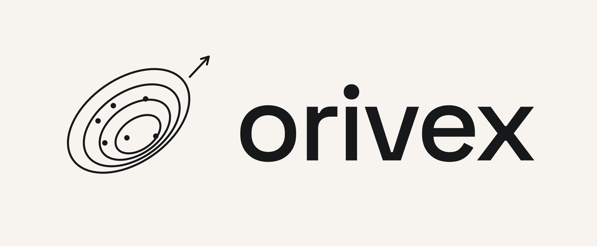

<p align="center">
  <picture>
    <source media="(prefers-color-scheme: dark)" srcset="assets/orivex-lockup-dark.png">
    <source media="(prefers-color-scheme: light)" srcset="assets/orivex-lockup-light.png">
    
  </picture>
</p>

<p align="center">
  <strong>A selective and fast engine for exploratory landscape analysis.</strong>
</p>

<p align="center">
  <a href="https://www.python.org/downloads/"></a>
  
  
</p>

<p align="center">
  <a href="https://helix-agh.github.io/orivex/">Documentation</a> ·
  <a href="https://helix-agh.github.io/orivex/getting-started/quickstart/">Quick start</a> ·
  <a href="https://helix-agh.github.io/orivex/api/">API reference</a> ·
  <a href="https://helix-agh.github.io/orivex/development/contributing/">Contributing</a>
</p>

**orivex** is a successor to [`pflacco`](https://github.com/Reiyan/pflacco)
for exploratory landscape analysis (ELA). Compute individually selected features from sampled
points and objective values, with shared intermediates, explicit costs, and versioned definitions.
A NumPy/SciPy core is complemented by an optional differentiable PyTorch backend.

The project is pre-release and is not yet a drop-in replacement for `pflacco`.

## Installation

Python 3.10 or newer is required. The package is not published yet; install from a checkout:

```bash
git clone https://github.com/helix-agh/orivex.git
cd orivex
uv sync
```

With pip, run `python -m pip install -e .`. Add the optional PyTorch backend with
`uv sync --extra torch` or `python -m pip install -e ".[torch]"`.

## Quick start

```python
import numpy as np

from orivex import LandscapeSample, compute

rng = np.random.default_rng(42)
x = rng.uniform(-5.0, 5.0, size=(200, 2))
y = np.sum(x**2, axis=1)
sample = LandscapeSample(x, y, lower=[-5.0, -5.0], upper=[5.0, 5.0])

result = compute(sample, ["ela_distr.skewness", "nbc.nn_nb.mean_ratio"])
for name, item in result.values.items():
    print(name, item.value, item.status.value)
```

Objective values are min-max normalized by default. Pass `y_normalization=None` to use raw
canonical objectives. Undefined features return an `invalid` status with an explanation.

## Documentation

Read the **[documentation](https://helix-agh.github.io/orivex/)** for installation, feature
selection, normalization, fitness-distance conventions, PyTorch support, and API reference.
The [feature overview](docs/features/index.md), [contributing guide](docs/development/contributing.md),
and [benchmark guide](docs/development/benchmarks.md) are also available in this checkout.

Preview the documentation locally:

```bash
uv sync --extra docs
uv run --no-sync mkdocs serve
```

See [documentation development](docs/development/documentation.md) for strict builds and deployment.

## License

orivex is licensed under the [MIT License](LICENSE.txt).
